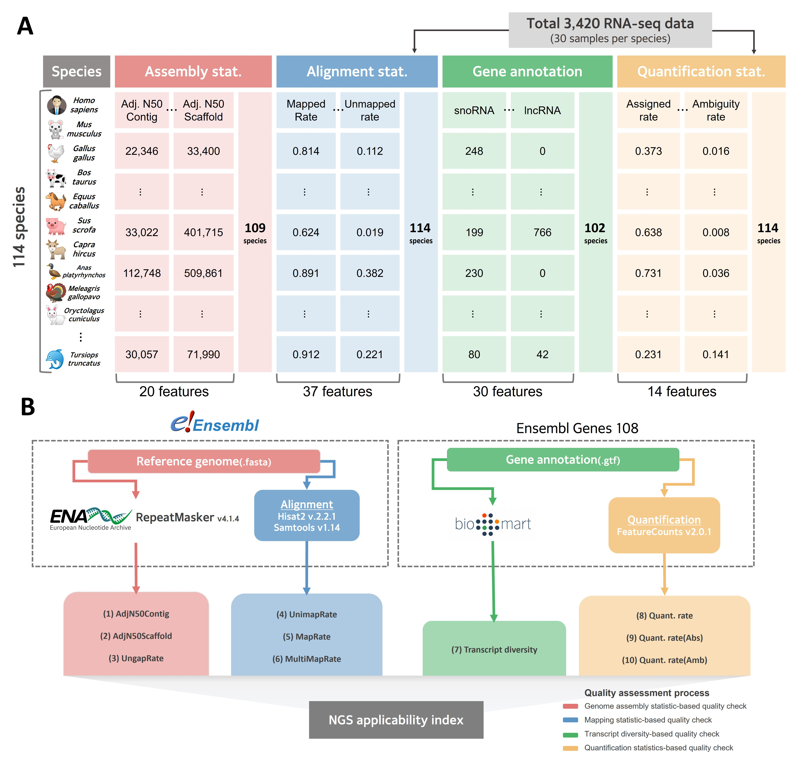

## Project Overview
**`대규모 의생명 데이터 파이프라인 구축 및 통계 분석을 통한 지표 개발`**   

- 📄 **Publication**  [Benchmark study for evaluating the quality of reference genomes and gene annotations in 114 species](https://doi.org/10.3389/fvets.2023.1128570)
  
- 🏆 **Journal**: *Frontiers in Veterinary Science* (SCI, JCR Top 10%) &nbsp;&nbsp;**수의학 분야 상위 10% 국제 저널 게재**
  
- 📊 **Citation**: 2025.06 기준, 9회 인용 

- 🙋‍♂️ **My Contribution**: 공동 제 1저자  문제 정의, 데이터 수집·전처리, 통계 분석 및 인사이트 도출, 시각화 등 **논문 전 과정에 50% 기여**
  

## Tech Stack
- **Programming**:

- **Visualization**:

- **Analysis**: `Data Preprocessing` `Data Normalization` `Exploratory Data Analysis` `Correlation Analysis` `Unsupervised Learning` `Data ETL pipeline`  `Visualization`

- **Data**
  - **기초 생물정보 통계 데이터** - 공식 생물정보 데이터베이스의 API를 활용한 자동 수집 (114종 x 50개 지표)
  - **대규모 염기서열 데이터** - 약 25TB 대규모 데이터 수집/ 전처리/ 정형화 파이프라인 구축을 통한 수집 (114종 x 51개 지표)

## Summary
### 🤔 Problem

현재 대부분의 생명과학 연구는 **두 가지 종류의 유전체 자료에 크게 의존**함. 그럼에도 불구하고, 다양한 종을 대상으로 **두 자료의 품질을 동시에 평가할 수 있는 체계적인 지표는 존재하지 않음**. 예컨대 사람이나 쥐처럼 활발히 연구된 종은 자료 품질이 높아 후속 연구의 신뢰성도 높을 수 있지만, 비주류 종은 품질이 낮을 가능성이 커 잘못된 연구 결과로 이어질 수 있음.

### 🔍 Approach & Workflow

이 문제를 해결하기 위해, **두 자료의 상대적 품질을 평가할 수 있는 지표를 선정하는 네 가지 프로세스**를 설계하였음

🟥 **Process Red**

공식 DB 기반 20개 지표 &nbsp;➔&nbsp;  전처리 &nbsp;➔&nbsp; EDA (기초 통계 분석, 그룹 간 비교 분석), 상관 분석 &nbsp;➔&nbsp; **3개 지표 선별**
 
> 지표 선택 시 어떻게 분석이 활용되었는가?

- 기존 품질 평가에 사용되던 지표를 포함한 일부 지표를 종의 특성에 맞춰 **정규화**한 뒤, 모든 지표 간 **상관 분석과 EDA**를 수행함

- 그 결과, 정규화된 기존 품질 지표와 강한 상관관계를 보이며, 동시에 품질이 높을 것이라 추정되는 **그룹에서 일관되게 높은/낮은 값**을 보이는 지표를 선별함 

- 지표의 **분포가 상향편중**되어 상대적 비교가 불가능 하거나, 연관성이 없는 지표들은 선별되지 않음
 

🟦 **Process Blue** 

파이프라인으로 확보한 37개 지표 &nbsp;➔&nbsp; 전처리 &nbsp;➔&nbsp; 상관 분석 &nbsp;➔&nbsp; **3개 지표 선별**
 
> 지표 선택 시 어떻게 분석이 활용되었는가?

- 37개 지표와 `Process Red`에서 선별된 3개 지표 간 **상관 분석**을 수행함

- 그 결과, 3개와 예상된 방향의 선형 관계를 가지며, 생물학적으로 해석이 가능한 지표들을 선별함 
 

🟩 **Process Green** 

공식 DB 기반 30개 지표 &nbsp;➔&nbsp; 전처리 &nbsp;➔&nbsp; 차원 축소, EDA, 상관 분석 &nbsp;➔&nbsp; **1개 지표 선별**
 
> 지표 선택 시 어떻게 분석이 활용되었는가?

- 활발하게 연구된 인간과 쥐 같은 종에 대비하여 상대적인 품질 수준을 측정할 수 있을 것이라는 가설을 세움 
 
- 30개 종류의 유전자 지표를 **주성분 분석**한 결과, PC1이 전체 분산의 77.92% 설명 가능했고 실제 다양성을 정량화한 척도인 Shannnon index와 매우 **강한 상관관계**를 보임
  
- 이후 PC1을 유전자 다양성 지표로 활용하여 각 지표와의 **상관 분석 및 EDA**를 수행한 결과, 인간과 같은 **모델 종에서 중요 유전자 수가 많고**, 기능이 **덜 알려진 유전자들도 다양하게 포함**되어 있음을 통해 가설을 증명함

- 위를 근거로, PC1을 상대적 품질 평가 지표로 선별함

 

🟨 **Process Yellow** 

파이프라인으로 확보한 14개 지표 &nbsp;➔&nbsp; 전처리 &nbsp;➔&nbsp; EDA, 상관 분석 &nbsp;➔&nbsp; **3개 지표 선별**
 
> 지표 선택 시 어떻게 분석이 활용되었는가?

- 평가하려는 자료의 **구조적 복잡성을 나타내는 변수**들을 계산하고, 이를 통해 수집한 14개 지표를 평가할 수 있을 것이라 가정함

- 자료의 구조적 복잡성 관련 변수와 14개 지표 간 **EDA**와 **상관 분석** 결과에 따라 생물학적 해석이 가능한 지표를 선별함

### 📈 Conclusion
선정된 총 10개 지표의 방향성 매칭 후, 가중 산술 평균을 이용하여 통합 ▶ 성공적으로 새로운 품질 평가 지표를 개발하였으며, 기존 연구와 비교하여 차별성을 검증함
  
## File Structure

분석 및 시각화 재현을 위한 데이터와 스크립트만 업로드하였음. 전체 데이터는 논문 부록 자료(Supplementary material)에서 확인할 수 있음.

### 📁 Data 
**species.txt**: &nbsp;114종의 학명 목록

**1_assembly_color_code.txt**: &nbsp;`Process Red` 그림에 사용된 색상 코드

**1_assembly_statistics.txt**: &nbsp;`Process Red`에 사용된 전처리된 데이터

**1_repeat_elements_data.txt**: &nbsp;`Process Red`에 사용된 서브 데이터

**2_mqi_statistics_of_108_species.csv**: &nbsp;`Process Blue`에서 선별된 3개 지표 데이터 

**2_selected_assembly_and_mapping_statistics_data.csv**: &nbsp;`Process Red`에 사용된 전처리된 데이터와 `Process Blue`에서 선별된 3개 지표를 통합한 데이터셋

**3_annotation_color_code.txt**: &nbsp;`Process Green` 그림에 사용된 색상 코드

**3_gene_annotation_table.txt**: &nbsp;`Process Green`에서 사용된 원시 데이터 

**3_taxanomy_table.txt**: &nbsp;114종의 분류학 정보

**4_quantification_data.csv**: &nbsp;`Process Yellow`에서 사용된 원시 데이터와 `Process Green`에서 선별된 1개 지표를 통합한 데이터셋

**4_quantification_data_sample.csv**: &nbsp;`Process Yellow`에서 선별된 3개의 지표 데이터

**5_ngs_applicable_index_with_97_species.csv**: &nbsp;전체 프로세스에 걸쳐 선별된 10개 지표와 이를 통합시킨 통합 품질 지표를 포함한 데이터셋

### 📑 Scripts
**package_manager.R**: &nbsp;다른 스크립트에서 필요한 패키지를 설치 및 로드하는 스크립트로, 직접 실행할 필요는 없음

**1_assembly_quality_statistic.R**: &nbsp;`Process Red`의 분석 및 시각화를 위한 R 스크립트. 구체적인 지표 선별 논리는 논문 참고.

**2_alignment_quality_statistics.R**: &nbsp;`Process Blue`의 분석 및 시각화를 위한 R 스크립트. 구체적인 지표 선별 논리는 논문 참고.

**3_gene_annotation_quality_statistic.R**: &nbsp;`Process Green`의 분석 및 시각화를 위한 R 스크립트. 구체적인 지표 선별 논리는 논문 참고.

**4_quantification_quality_statistics.R**: &nbsp;`Process Yellow`의 분석 및 시각화를 위한 R 스크립트. 구체적인 지표 선별 논리는 논문 참고.

**5_ngs_applicable_index.R**: &nbsp;선택된 10개의 지표와 통합 품질 지표를 시각화하는 R 스크립트

**data-pipeline/**: 생물학적 데이터를 정형화하기 위한 파이프라인 bash 코드가 포함된 디렉토리 

